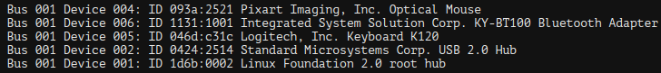
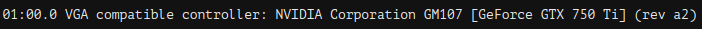
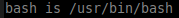

===

Em um sistema que utilza BIOS qual é a ordem de boot?

---

Bios > MBR > Bootloader(GRUB) > Kernel > Init

===

Em qual arquivo ficam os sinais de interrupção do sistema (IRQ)?

---

/proc/interrupts

===

Onde o linux guarda os endereços de IO?

---

/proc/ioports

===

Onde o linux guarda os acessos diretos à memoria (DMA)?

---

/proc/dma

===

Qual comando serve para ver o que está conectado no barramento pci?

---

lspci

===

Qual o comando que serve para ver o que está conectado no barramento usb?

---

lsusb

===

Como ver detalhes do barramento pci?

---

lspci -s id_barramento -v

===

Como ver detalhes do barramento usb?

---

lsusb -s bus:device -v

===

Qual comando e parametro exibe continuamente o final de um arquivo conforme novos conteúdos são acrescentados a ele?

---

tail -f

===

Qual é o arquivo que guarda informaçoes sobre a cpu da maquina?

---

/proc/cpuinfo

===

Qual arquivo guarda os parâmetros passados para o kernel no momento de boot?

---

/proc/cmdline

===

Qual arquivo guarda informações sobre a memoria do computador?

---

/proc/meninfo

===

Qual é o arquivo que guarda informações sobre os tipos de filesystems suportados pelo kernel?

---

/proc/filesystems

===

Qual é o arquivo que que mostra os  mostra o status dos filesystems montados?

---

/proc/mounts

===

qual é o tipo de filesystem que é usado para gerar algo dinamicamente?

---

tmpfs

===

Qual é o sinal responsavél pelo deligamento do sistema linux?

---

acpid

===

Cite duas ferramentas usadas para poder rodar processos em outras sessões?

---

- tmux
- screen

===

Cite 3 formas de salvar e sair no editor de texto vim.

---

- :x
- :wq
- ZZ

===

Qual comando me mostra os modulos carregados?

---

lsmod

===

Qual comando é passado para remover modulos carregados?

---

- modprob -r module_name
- rmmod module_name

===

Em qual diretorio fica as regras que bloqueiam o carregamento dos modulos de sistema?

---

/etc/modprobe.d

===

Qual comando carrega um módulo do kernel e automaticamente carrega demais módulos que sejam necessários para seu funcionamento?

---

modprobe

===

Em qual lugar fica as configurações de runlevel padrão em um sistema init?

---

/etc/inittab

===

Em um sistema sysV, qual é o runlevel de single user?

---

runlevel 1

===

Quais comandos são utilizados para alterar o runlevel de uma máquina que usa um sistema sisV?

---

init, telinit

===

Em um sistem sysV, qual comando comando e parametro são usados para recarregar a configuração do init?

---

telinit q

===

Onde fica os arquivos de units do systemd?

---

/lib/systemd/system

===

Em um sistema que utiliza o systemctl qual parametro é usado para mudar de runlevel?

---

systemctl isolete

===

Qual comando eu verifico o status de um serviço no systemd?

---

systemctl status service_name.servce

===

Qual diretorio guarda informações sobre as unidades do systemd?

---

/lib/systemd/system

===

Cite três formas de reiniciar um sistema linux:

---

- init 6
- shutdown -r
- reboot

===

Qual comando permite mandar uma mensagem para todos os usuarios logados no sistema?

---

wall

===

Quais comandos podem ser utilizados para ver o processo de boot?

---

- dmesg
- journalctl -b

===

Em uma máquina que utliza BIOS, qual é o estágio de boot responsável por carregar o bootloader (grub)?

---

MBR

===

Em um sistema UEFI qual é o processo de boot?

---

UEFI > Bootloader(grub) > Kenel > Init

===

Qual comando que me permite verificar a versão do kernel?

---

uname -r

===

Em qual diretório é por padrão montada a partição ESP (EFI System Partition)?

---

/boot/efi

===

Ao executar o comando `nice -10 service`, qual atributo e valor é definido ao processo?

---

 

===

Um sistema que possui as seguintes partições:

Quantas partições são do tipo lógica?
Existe alguma partição do tipo extendida?

---

===

Qual variável embutida no Bash retorna o valor do PID do shell atual?

---

$$

===

Qual variável de ambiente contém o nome do arquivo utilizado para armazenar os últimos comandos utilizados por um usuário?

---

nash_histo

===

Em quais diretórios de um sistema Linux estão localizados arquivos binários que só podem ser executados pelo usuário root?

---

===

Quais são as partições virtuais?

---

===

qual processo é responsável por referenciar os dispositivos conectados?

---

===

Qual serviço e responsavel por lidar com as questões de energia?

---

===

Informe pelo menos 3 comandos diferentes para reiniciar uma máquina Linux.

---

===

Em um sistema que utilza UEFI qual é a ordem de boot?

---

===

Em um sistema que utiliza UEFI one fica a partição ESP?

---

===

Considere o seguinte texto exibido num terminal:

Qual comando produz uma saída como essa?

---

lsusb

===

Considere o seguinte texto exibido num terminal:

Qual das alternativas a seguir produz uma saída como essa?

- A - Executar o comando lspci VGA*
- B - Exibir o conteúdo do arquivo /proc/pci/01.00.0
- C - Executar o comando lspci -s 01:00.0
- D - Executar o comando lspci -v 01:00.0
- E - Exibir o conteúdo do arquivo /sys/bus/pci/01:00.0

---

C

===

Qual é o comando usado para verificar o nível de execução atual em um sistema que utiliza o SysVinit?

---

runlevel

===

Qual dos comandos a seguir pode ser utilizado para listar as partições do dispositivo /dev/sda?

- A - cat /proc/partitions/sda
- B - fdisk -p /dev/sda
- C - ls /dev/sda
- D - fdisk -l /dev/sda
- E - cat /dev/sda

---

D

===

Qual é o código hexadecimal que identifica uma partição Linux Swap em um disco particionado no padrão MBR?

---

82

===

Qual é o comando utilizado para exibir as bibliotecas compartilhadas que um programa necessita? (sem opções ou parâmetros.)

---

ldd

===

Um novo repositório de software foi incluído num sistema que utiliza o gerenciador de pacotes do Debian.
Qual das alternativas a seguir deve ser realizada para que os pacotes desse repositório estejam disponíveis para instalação no sistema local?

- A - Executar o comando apt-get dist-upgrade
- B - Executar o comando apt-get upgrade
- C - Executar o comando apt-get repo-update
- D - Executar o comando apt-get update
- E - Executar o comando apt-get refresh

---

D

===

Qual é a opção do comando dpkg que mostra qual pacote instalou um arquivo indicado?

- A - -S
- B - --contents
- C - --search
- D - -L
- E - --file

---

A

===

Quais das alternativas a seguir são diretórios na partição raiz que podem ser pontos de montagem para partições em outros dispositivos? (Escolha três respostas corretas.)

- A - /sbin
- B - /opt
- C - /home
- D - /etc
- E - /var

---

B, C, E

===

Quais das alternativas a seguir são informações corretas a respeito do KVM? (Escolha duas respostas corretas.)

- A - Diferente do LXC, no KVM o kernel do hospedeiro não controla os processos do convidado.
- B - Como o D-BUS, O KVM é um sistema de comunicação entre processos (IPC).
- C - O KVM simula um ambiente de hardware para executar um sistema virtualizado
- D - O KVM permite escolher qual sistema operacional será carregado assim que a máquina é ligada.
- E - O KVM é um sistema de acesso remoto, como o VNC.

---

A, B

===

Quais das alternativas a seguir são comandos que podem ser utilizados para instalar novos programas num sistema que utiliza o gerenciamento de pacotes Red Hat? (Escolha três respostas corretas.)

- A - dnf
- B - yum
- C - dpkg
- D - zypper
- E - apt-get

---

A, B, D

===

Um usuário com acesso de root deseja reiniciar o sistema após uma atualização bem sucedida realizada com o comando apt-get dist-upgrade -y.
Qual das alternativas a seguir cumpre adequadamente essa tarefa?

- A - Executar o comando apt-get dist-upgrade -y && systemctl reboot
- B - Executar o comando apt-get dist-upgrade -y || systemctl reboot
- C - Executar o comando apt-get dist-upgrade -y ; systemctl reboot
- D - Executar o comando apt-get dist-upgrade -y & systemctl reboot
- E - Executar o comando if [ `apt-get dist-upgrade -y` -eq 0 ]; then systemctl reboot; fi

---

A

===

Qual é o comando que redireciona o conteúdo recebido na entrada padrão para a saída padrão e ao mesmo tempo salva o conteúdo num arquivo indicado? (Escreva somente o comando, sem opções ou parâmetros.)

---

tee

===

Qual é a opção do comando `tar` que indica a utilização da compactação com bzip2?

- A - -j
- B - -J
- C - -Z
- D - -bz
- E - -z

---

A

===

Qual das alternativas a seguir descreve a finalidade do comando paste?

- A - Juntar dois ou mais arquivos
- B - Exibir o conteúdo de dois arquivos lado a lado
- C - Enviar um texto para outro usuário
- D - Exibir o histórico de comandos
- E - Colar o conteúdo da área de transferência

---

B

===

Qual das alternativas a seguir descreve a finalidade do comando tac?

- A - Exibir o conteúdo de um arquivo
- B - Enviar um texto para outro usuário
- C - Exibir o conteúdo de um arquivo sem tabulações
- D - Receber um arquivo via rede
- E - Exibir o conteúdo de um arquivo na ordem inversa

---

E

===

Quais das alternativas a seguir são comandos que podem alterar a prioridade de um processo em execução? (Escolha duas respostas corretas.)

- A - ps
- B - ulimit
- C - nice
- D - renice
- E - top

---

===

Um usuário do sistema verificou que alguns dos links simbólicos em seu diretório pessoal deixaram de funcionar.
Qual das alternativas a seguir foi uma possível causa desse problema?

- A - O nome do link simbólico foi alterado.
- B - O link simbólico foi criado tendo um diretório como alvo.
- C - O link simbólico foi criado com um alvo que está num sistema de arquivos diferente.
- D - O alvo do link simbólico foi movido para outra localização.
- E - O conteúdo do alvo do link simbólico foi alterado.

---

D

===

Considere o seguinte texto exibido num terminal:

Qual das alternativas a seguir produz uma saída como essa?

- A - Executar o comando type bash
- B - Executar o comando whatis bash
- C - Executar o comando file /usr/bin/bash
- D - Executar o comando ls -i /usr/bin/bash
- E - Executar o comando which bash

---

A

===

Qual é o comando que converte um sistema de arquivos ext2 em /dev/sdx1 para ext3 sem perda de dados? (comando completo, incluindo as opções e parâmetros.)

---

===

Qual é o comando que ativa uma área de memória swap em um dispositivo já formatado para esse fim? (comando, sem opções ou parâmetros.)

---

swapon

===

Qual é o comando interno do fdisk que cria uma nova partição no disco atual?

- A - n
- B - c
- C - a
- D - p
- E - w

---

A

===

Qual será a permissão padrão que será utilizada para novos arquivos caso o valor da máscara umask esteja definido em 0002?

- A - u=rwx,g=rwx,o=r
- B - u=r,g=r,o=r
- C - u=rwx,g=rwx,o=rx
- D - u=rw,g=r,o=r
- E - u=rw,g=rw,o=r

---

E

===

Qual das alternativas a seguir descreve o propósito do terceiro campo em uma linha do arquivo /etc/fstab?

- A - Indicar as opções de checagem do sistema de arquivos.
- B - Indicar as opções de montagem.
- C - Indicar o sistema de arquivos da partição.
- D - Indicar a prioridade de montagem.
- E - Indicar o ponto de montagem.

---

C

===

Qual das alternativas a seguir descreve a finalidade do comando chgrp?

- A - Alterar as propriedades de um grupo de usuários.
- B - Alterar o nome de um grupo de usuários.
- C - Alterar o grupo dono de um arquivo ou diretório.
- D - Alterar o shell padrão para um grupo de usuários.
- E - Alterar o grupo do usuário atual.

---

C

===

Quais das alternativas a seguir são comandos que verificam a integridade de sistemas de arquivos no Linux ? (Escolha três respostas corretas.)

- A - fsck
- B - fsck.msdos
- C - e2fsck
- D - fdisk
- E - scandisk

---

A, B. C

Em um sistema que utiliza bios, qual local do disco fica gravado as informações do Boot loader (grub)?

---

nos primeiros 446 bytes do disco

===
